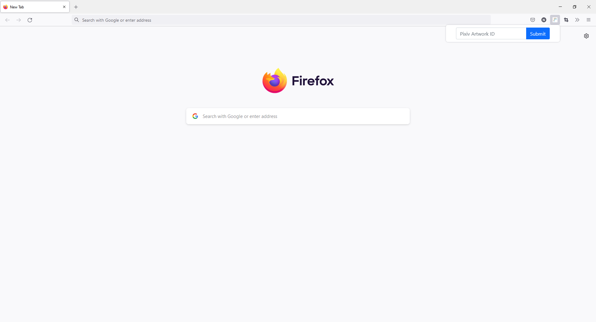
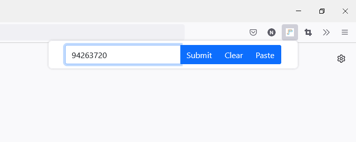
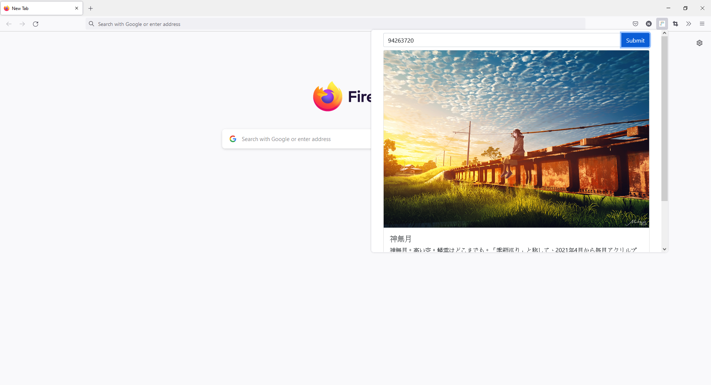
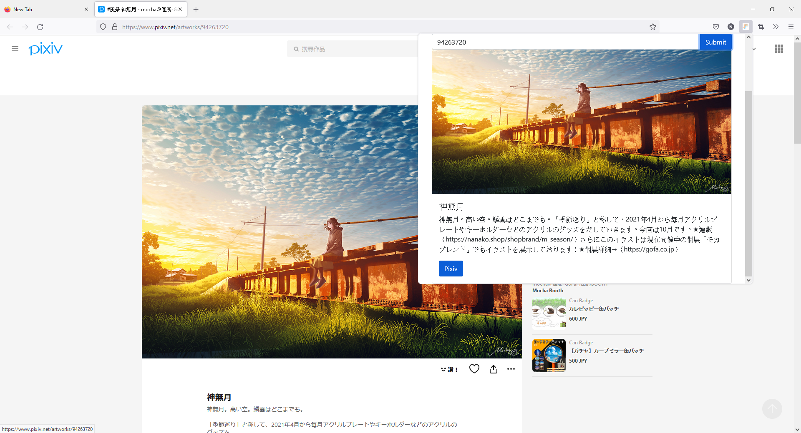

# Pixiv Pass

Pixiv Pass is a FireFox Extension allowing the user preview a Pixiv artwork with providing the artwork ID.

This project consists of two parts: the front end UI and the back end API. The front end UI applies NextJS framework. The back end API utilizes AWS CDK to deploy AWS Lambda Functions and API Gateway. With the interactions between the two parts, the main functionality is provided.

## Usage

1. Click on the browser action button. The UI will popup.
   

2. Enter a Pixiv ID to the search bar text input.
   

3. Click submit button. The artwork will be displayed in the popup Area.
   

4. Scroll down and click on the Pixiv button. The Pixiv artwork page will be opened in a new tab.
   

## Environment

### Front end

- Firefox Extension Manifest 2
- NodeJS 14
- NextJS 12
- React 17
- React Bootstrap 2.0

### Back End

- AWS CDK 1.133.0
- AWS Lambda Function
- AWS API Gateway
